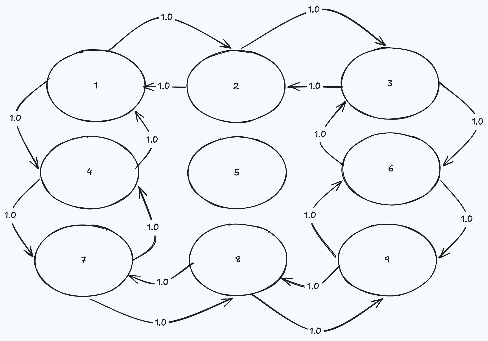

#+TITLE: Shortest Paths in Julia: Dijkstra & A*
#+OPTIONS: toc:2

From-scratch implementations of Dijkstra's algorithm and A* in Julia, built
as a learning exercise: a naive O(V^2) Dijkstra, a priority-queue-based
O((V+E) log V) Dijkstra, and A* built on top of it with an admissible
Euclidean heuristic.

* Graph representation

A directed, weighted graph is a =Dict= mapping each node to a list of
=(neighbor, weight)= pairs - an adjacency list:

#+begin_src julia
const Graph = Dict{Int64, Vector{Tuple{Int64, Float64}}}
#+end_src

A =Dict= was chosen over a =Vector= so that lookups don't depend on nodes
being small, contiguous integers - any hashable node id works, and a node
can be queried directly by key rather than by scanning an array.

*Important:* every node that exists must appear as a key, even ones with no
outgoing edges (an empty vector, =[]=). Otherwise the bookkeeping used by
the algorithms (distance/visited maps keyed on the same nodes) has no slot
for it.

* Example graph

The example graph used throughout is a 3x3 grid with the center node ( =5= )
walled off - it has no incoming or outgoing edges, so it can never be
reached or used as a shortcut. This gives two equally-short paths around the
wall, which is useful for sanity-checking A* against Dijkstra.

#+begin_src julia
g = Graph(
    1 => [(2, 1.0), (4, 1.0)],
    2 => [(1, 1.0), (3, 1.0)],
    3 => [(2, 1.0), (6, 1.0)],
    4 => [(1, 1.0), (7, 1.0)],
    5 => [],
    6 => [(3, 1.0), (9, 1.0)],
    7 => [(4, 1.0), (8, 1.0)],
    8 => [(7, 1.0), (9, 1.0)],
    9 => [(6, 1.0), (8, 1.0)],
)

## (x, y) coordinates, used by A*'s heuristic
coords = Dict(
    1 => (0.0, 2.0), 2 => (1.0, 2.0), 3 => (2.0, 2.0),
    4 => (0.0, 1.0), 5 => (1.0, 1.0), 6 => (2.0, 1.0),
    7 => (0.0, 0.0), 8 => (1.0, 0.0), 9 => (2.0, 0.0),
)
#+end_src

Node layout (matching the coordinates above):

#+begin_example
1(0,2)  2(1,2)  3(2,2)
4(0,1)  5(1,1)  6(2,1)   <- 5 is walled off, isolated
7(0,0)  8(1,0)  9(2,0)
#+end_example

With source =7= and target =3=, the shortest distance is =4.0=, via either
=7 -> 4 -> 1 -> 2 -> 3= or =7 -> 8 -> 9 -> 6 -> 3=.

* Functions

** =dijkstra(g, source)=

Priority-queue-based Dijkstra. Returns a named tuple =(distances, hops,
visited)=:
- =distances= :: shortest distance from =source= to every reachable node
- =hops= :: predecessor map, used to reconstruct a path
- =visited= :: the set of nodes the search actually finalized

Uses a =PriorityQueue= (from DataStructures.jl) to pick the next node to
expand in O(log n) instead of a linear scan, and =PriorityQueue='s
=setindex!= to decrease-key in place when a shorter path to an already-queued
node is found.

*Requires non-negative edge weights.* The algorithm permanently finalizes a
node's distance the moment it's popped, on the assumption that no future
relaxation can ever find something shorter. That assumption only holds when
weights can't be negative - see =shortpath= below for the same idea done
without a priority queue.

** =astar(g, source, target, coords)=

A* built directly on top of =dijkstra=. Two changes:

1. Only search towards a specific =target=, and stop as soon as it's popped
   (Dijkstra computes distances to every node; A* only needs one).
2. The priority queue orders nodes by =f = g + h= instead of just =g= - the
   true accumulated cost (=g=, tracked in =distances=, exactly like
   Dijkstra) plus a heuristic estimate (=h=) of the remaining distance to
   =target=.

*Gotcha:* once the queue orders by =f= instead of =g=, whatever
=dequeue_pair!= hands back is no longer the true distance - it's
contaminated with the heuristic. All arithmetic must go through
=distances[current_node]= (pure =g=), never through the popped priority
directly.

*Correctness requirement:* =h= must be admissible (never overestimate the
true remaining cost) - here, straight-line (Euclidean) distance, which can
never exceed the true path distance through a grid. Ideally =h= should also
be consistent (=h(u) <= weight(u,v) + h(v)= for every edge), which is the
A* analogue of Dijkstra's non-negative-weight requirement.

** =h(node, target, coords)=

Euclidean distance between two nodes' coordinates - the heuristic used by
=astar=.

** =reconstruct_path(hops, source, target)=

Walks the =hops= map backward from =target= to =source= and returns the
path in forward order. Handles two edge cases explicitly:
- =source == target= returns the trivial path =[source]=
- an unreachable =target= (never present in =hops=) returns =nothing=
  instead of raising a =KeyError=

** =shortpath(g, source)=

The naive O(V^2) reference version: a plain =Dict= for distances, a =BitSet=
for visited nodes, and a linear scan (=argmin=) to find the next node to
expand instead of a priority queue. Kept around to cross-check the
priority-queue version against - both should always agree on every
=distances= value for the same graph and source.

* Usage

#+begin_src julia
include("search.jl")

# Dijkstra: distances to every node from 7
d = dijkstra(g, 7)
d.distances[3]                       # => 4.0

# A*: just the distance/path to a specific target
a = astar(g, 7, 3, coords)
a.distances[3]                       # => 4.0
reconstruct_path(a.hops, 7, 3)       # => [7, 4, 1, 2, 3]
#+end_src
