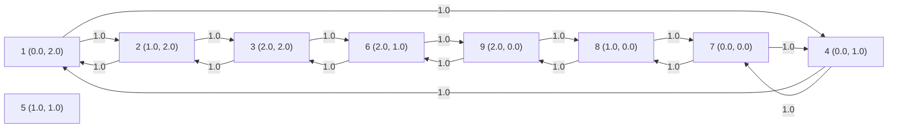

```mermaid
flowchart LR
    n1["1 (0.0, 2.0)"]
    n2["2 (1.0, 2.0)"]
    n3["3 (2.0, 2.0)"]
    n4["4 (0.0, 1.0)"]
    n5["5 (1.0, 1.0)"]
    n6["6 (2.0, 1.0)"]
    n7["7 (0.0, 0.0)"]
    n8["8 (1.0, 0.0)"]
    n9["9 (2.0, 0.0)"]

    n1 -->|1.0| n2
    n1 -->|1.0| n4
    n2 -->|1.0| n1
    n2 -->|1.0| n3
    n3 -->|1.0| n2
    n3 -->|1.0| n6
    n4 -->|1.0| n1
    n4 -->|1.0| n7
    n6 -->|1.0| n3
    n6 -->|1.0| n9
    n7 -->|1.0| n4
    n7 -->|1.0| n8
    n8 -->|1.0| n7
    n8 -->|1.0| n9
    n9 -->|1.0| n6
    n9 -->|1.0| n8
```
